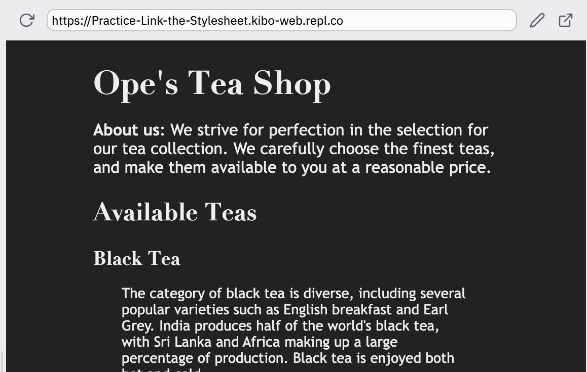

# Practice: Link the Stylesheet

There's a page of HTML elements, and there's a complete `style.css` file... but the styles still aren't getting applied.

Fix the issue and apply all the styles by using the `<link>` element to connect `style.css` to the `index.html` file.

## Steps

* Click 'Run' to see the webpage without the styles
* Add the link tag to the `<head>` of `index.html`
* Run the code to check that the styles are applied

When the styles are linked, the page should look like this:

